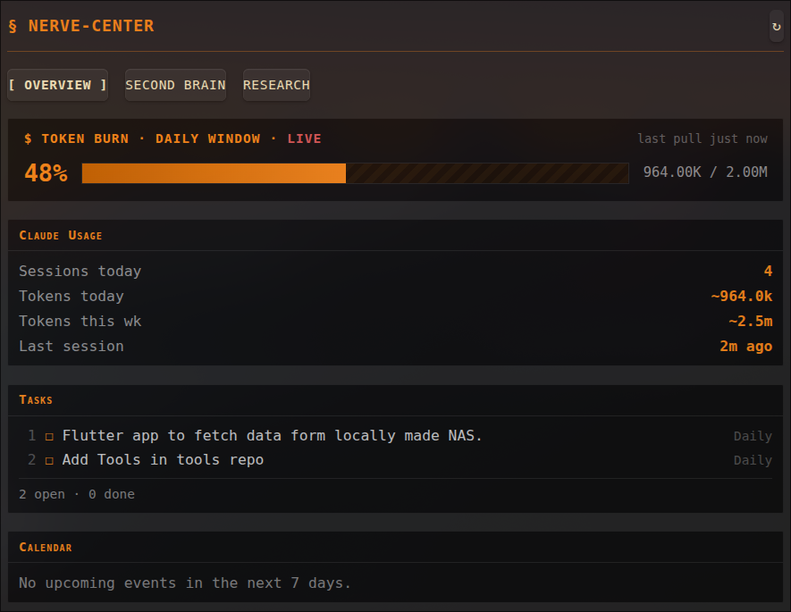

# Nerve-Center

A modular, personal home-base dashboard for Obsidian: calendar, tasks, Claude
Code usage, and a text/voice Q&A widget that answers questions about your own
vault using the `claude` CLI - no custom RAG/embeddings layer.



Design doc and progress log: `Projects/SecondBrain-Dashboard.md` in the vault
(the plugin's internal id and this note's filename still say
"secondbrain-dashboard" - only the user-facing name changed to Nerve-Center).

## Overview tab

- **Token burn** - a live progress bar showing today's token usage against a
  self-set daily budget (2M by default - not Anthropic's actual plan limit,
  which isn't available locally).
- **Claude Usage** - reads local `~/.claude` session logs for today's/this
  week's token usage and recent activity, no auth. Polls every 60s.
- **Tasks** - scans open/closed checkboxes across the vault, refreshes on any
  vault file change.
- **Calendar** - Google Calendar agenda via an OAuth 2.0 loopback + PKCE flow
  (RFC 8252). Needs a Google Cloud OAuth "Desktop app" client with the
  Calendar API enabled; configure under the widget's settings. Polls every
  5 min.

A single "refresh all" button in the top-right of the header refreshes every
widget at once.

## Second Brain tab

**Ask your Vault** - spawns `claude -p --add-dir <vault> --allowedTools "Read
Glob Grep"` so it can only search/read vault files, never the internet or
shell. Fed live open-tasks/upcoming-events context alongside the question.

Voice: mic input transcribes locally via **whisper.cpp** (no API key, no
cloud) - configure the binary/model path under the widget's settings, or let
it auto-detect a standard install. Answers asked by voice are read back with
the browser's `speechSynthesis`.

## Research tab

Empty for now.

## Development

```
npm install
npm run dev      # watch mode, rebuilds main.js on change
npm run build    # type-check + production build
```

Dev-symlink the project folder into a vault's `.obsidian/plugins/` and
enable it in Community plugins to test changes.

## Manually installing

Copy `main.js`, `styles.css`, `manifest.json` into
`VaultFolder/.obsidian/plugins/secondbrain-dashboard/`.
